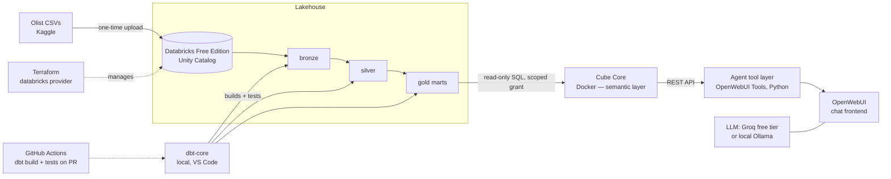

# AI-Ready Semantic Layer

An AI agent that answers business questions through a governed semantic layer — not by writing raw SQL.

**The thesis:** letting an LLM write raw SQL against a warehouse is fragile and ungovernable. Putting a semantic layer between the agent and the warehouse means the agent only selects pre-defined, tested metrics and dimensions through an API. Determinism, governance, and security come from the layer, not the model.

## Architecture

## Stack

| Layer | Tool | Cost |
|-------|------|------|
| Warehouse | Databricks Free Edition | €0 |
| Transformation | dbt-core + dbt-databricks | €0 |
| Semantic Layer | Cube Core (Docker) | €0 |
| Chat Frontend | OpenWebUI (Docker) | €0 |
| LLM | Groq / Google AI Studio free tier | €0 |
| IaC | Terraform | €0 |
| CI | GitHub Actions | €0 |
| Dataset | Olist Brazilian E-Commerce (Kaggle) | €0 |

**Total required cost: €0** — no credit card needed for any component.

## Dataset

This project uses the [Olist Brazilian E-Commerce dataset](https://www.kaggle.com/datasets/olistbr/brazilian-ecommerce) from Kaggle.

> **License:** CC BY-NC-SA 4.0 — Attribution required, non-commercial use only.

## Status

- [x] Week 1: Scoping & foundations
- [ ] Weeks 2–3: Ingestion & staging
- [ ] Weeks 4–5: Gold marts
- [ ] Week 6: Semantic layer (Cube)
- [ ] Week 7: Agent v1
- [ ] Week 8: Evaluation harness
- [ ] Week 9: Terraform & CI
- [ ] Week 10: Polish & demo
- [ ] Weeks 11–12: Blog posts
